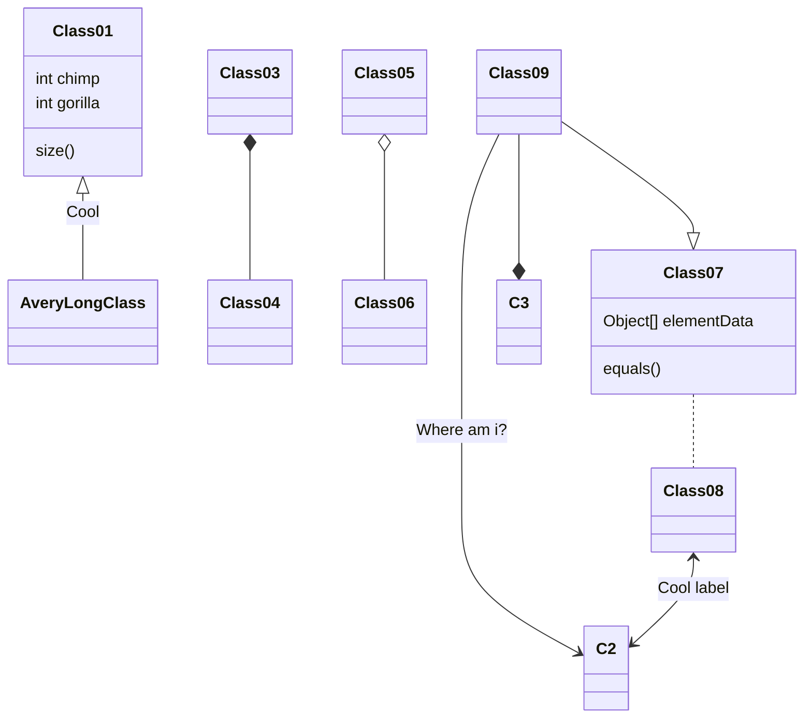

# Clustering-in-Object-Centric-Process-Mining
This is the Repository of team #5 of the SoftwareProjektPraktikum. This project is developed during WiSe 21/22 by 5 RWTH Aachen University students

```mermaid
classDiagram
Class01 <|-- AveryLongClass : Cool
Class03 *-- Class04
Class05 o-- Class06
Class07 .. Class08
Class09 --> C2 : Where am i?
Class09 --* C3
Class09 --|> Class07
Class07 : equals()
Class07 : Object[] elementData
Class01 : size()
Class01 : int chimp
Class01 : int gorilla
Class08 <--> C2: Cool label
```
