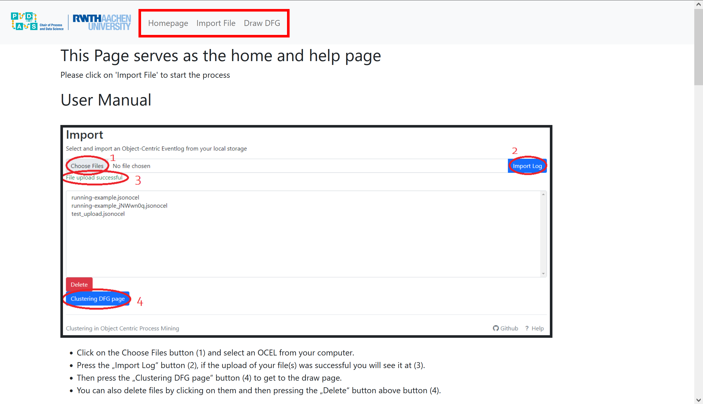
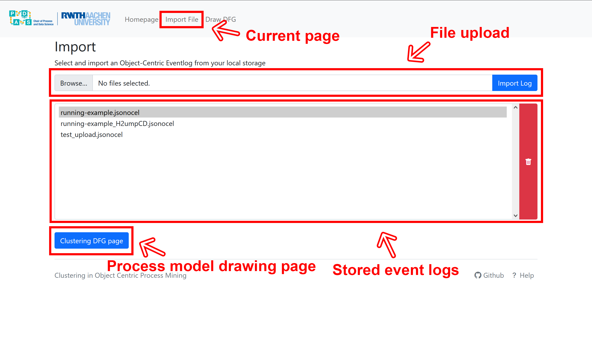
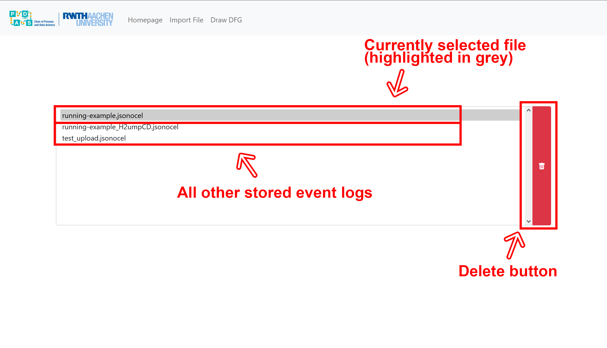
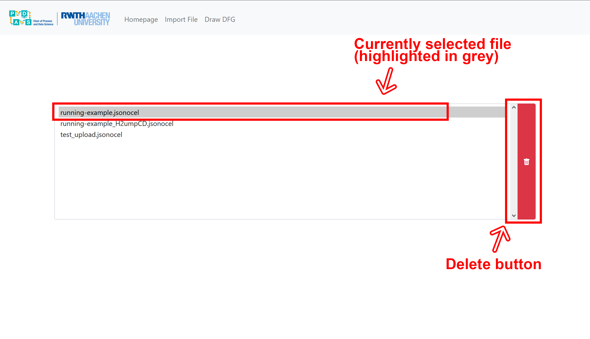
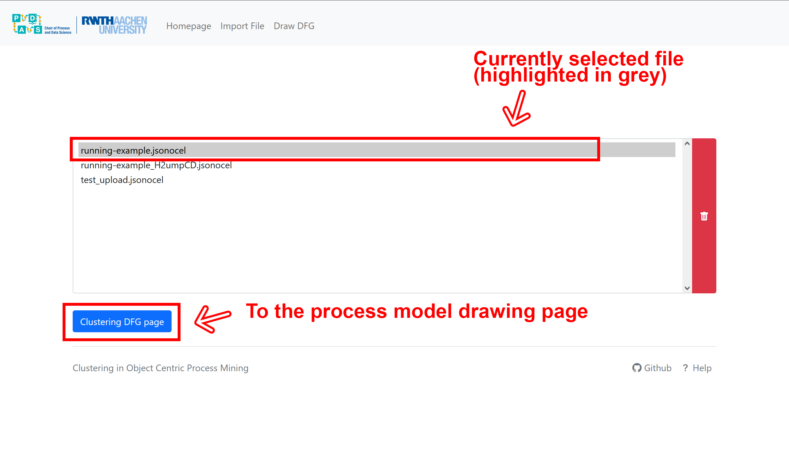
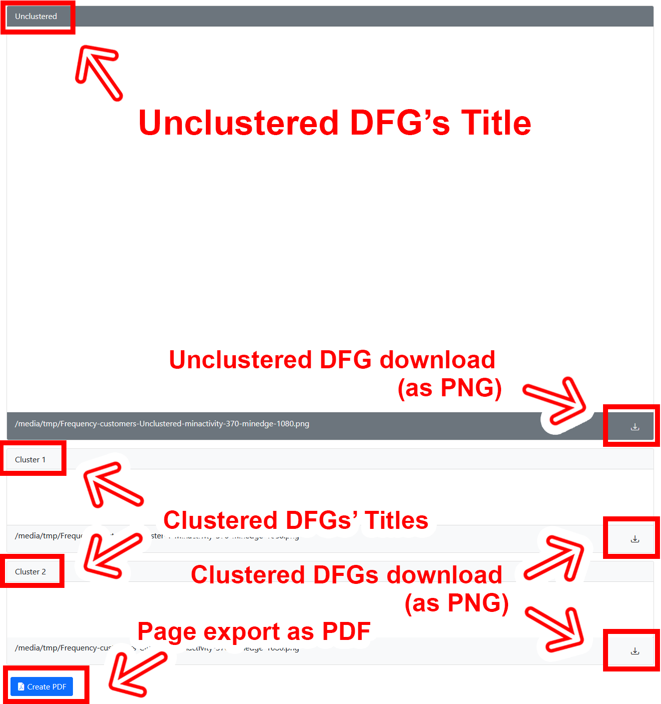

 

# Clustering in Object Centric Process Mining: User Manual

---

Authors: [@Simon Michau](https://github.com/simonmichau), [@Justus Nikolaus](https://github.com/Justus-Nitroklaus), [@Marawan Emara](https://github.com/MarawanEmara), [@Ventsislava](https://github.com/ventsislava2207), [@lisawanko](https://github.com/lisawanko)

 

## Table of contents
* [Project Setup](#project-setup)
* [Understanding the Application Layout](#understanding-the-application-layout)
* [Uploading an Object-Centric Event Log (OCEL)](#uploading-an-object-centric-event-log)
* [Deleting an Event Log](#deleting-an-event-log)
* [Generating Clusters and a Process Model for the OCEL](#generating-clusters-and-a-process-model-for-the-OCEL)
* [Exporting the Results](#exporting-the-results)

 

## Project Setup

### Requirements Overview

 

* Requires Python, pip and Graphviz.
* Requires Docker for the creation of a container, which may be downloaded here: https://docs.docker.com/docker-for-windows/install/.

### Initialisation

 

* Firstly, clone the project to your local using `git clone git@github.com:Justus-Nitroklaus/Clustering-in-Object-Centric-Process-Mining.git`.
* After cloning to your local, run the command `pip install -r requirements.txt` to download all requirements and run `python manage.py migrate` to apply all migrations in order for the database to work.

### Running without a Container

 

* Run the command `python manage.py runserver` in the project directory in order to run the development server at `http://127.0.0.1:8000/`.
* Open `http://127.0.0.1:8000/` in your browser and you should be able to run the project.

### Creating & Running a Docker Container

 

* Run the command `docker build . -t [image_name]` with `[image_name]` being whatever name you want to give the image. For example: `docker build . -t ciocel_one`. This should build a Docker image with the passed name.
* Run the Docker container that you have created using the command `docker run -d -p 8000:8000 [image_name]`, while replacing `[image_name]` with the name you have previously given the image. That should run the container in detached mode and port it to your local host; `http://127.0.0.1:8000/`.
* Open `http://127.0.0.1:8000/` in your browser and you should be able to run the project.

 

## Understanding the Application Layout

* All pages feature a navigation bar linking to all three pages of the application:
	* The 'Homepage' hosts the User Manual of the application
	* The 'Import File' page handles the upload and deletion of OCELs
	* The 'Draw DFG' page contains the main functionality of this application, i.e. the selection of clustering settings and the clustering itself

 

## Uploading an Object-Centric Event Log

* After you have landed in the file import page, this should be your view; here you will see a functionality to upload event logs from your local files, a listing of all currently available event logs, and a button that brings you to the DFG drawing page.

* Using the 'Browse' button, you can pick and then upload OCEL-standard files formatted as .jsonocel.
* After selecting a file for upload, its name will be displayed on the right of the 'Browse' button.
* After making sure that you have selected the file you want to work with, press the "Import Log" button. Your file will then be uploaded if it is a valid Object-Centric eventlog with the correct file extension. Should the upload fail, an error message will be displayed.

* In the file list, you are able to view which files you have previously uploaded. 

 

## Deleting an Event Log

* If you wish to delete a file, simply click on the file to remove so it is highlighted and then press the red delete button.

 

## Generating Clusters and a Process Model for the OCEL

### Going from the Import Page to the Draw Page

 

* If you are done uploading your files, press the blue 'Clustering DFG page' to head on over to the Draw page

### Drawing the Clusters and the Main Process Model

 

#### Event Log Selection

 

* Having landed in the draw page, you are now able to simply click on the dropdown menu and select one of your previously uploaded event logs. After selecting, a few blue badges stating the number of events, objects and activities of the eventlog should appear under the menu.

#### Object Type Selection

 

* Following the selection of an event log, you are able to select an object type by clicking on the dropdown menu right below it.

#### Selecting the Object's Attributes

 

* After selecting an object type for which to cluster, you are able to select one or more object attributes that you would like your DFGs to be clustered around.

#### Selecting a Clustering Method

 

* The last step ist to select a clustering method (either K-means or Hierarchical) and the method for assigning events to the clusters (either All or Existence).
* If you choose "All" event assignment, an event is just assigned to a cluster if ALL objects in that event are in that cluster.
* If you choose "Existence" event assignment, an event is assigned to a cluster as soon as AT LEAST ONE object from the event is in the cluster.

#### Drawing the Process Model DFGs

 

* Simply press the "Cluster" button! The clustering process may take some time, depending on the OCELs size.

#### Filtering your Selections

 

* You can set the minimum number of activities and edges using the sliders 'Minactivity' and 'Minedge', both in a range of zero to 5000. Edges and Nodes below these thresholds will not be displayed in the DFGs
* After the filters have been set, you need to press the "Filter" button to apply them.
* Filtering of a cluster can be done repeatedly, even after the creation of a cluster. Just make sure to change the ranges and then press the "Filter" button.

 

## Exporting the Results

* Following the drawing of the DFGs, you are able to see the main, unclustered process model at the top (named "Unclustered"), as well as all cluster process models below that (named "Cluster n" with n denoting a simple enumeration). 
* You can download the DFG for each process model separately as a PNG by using the download button right below the DFG on the right hand corner. By clicking on a DFG you can also spectate it separately.
* If you would like, you also have the possibility of downloading a PDF containing all DFGs and the settings used to create them by simply clicking the "Create PDF" button at the very bottom.

 

